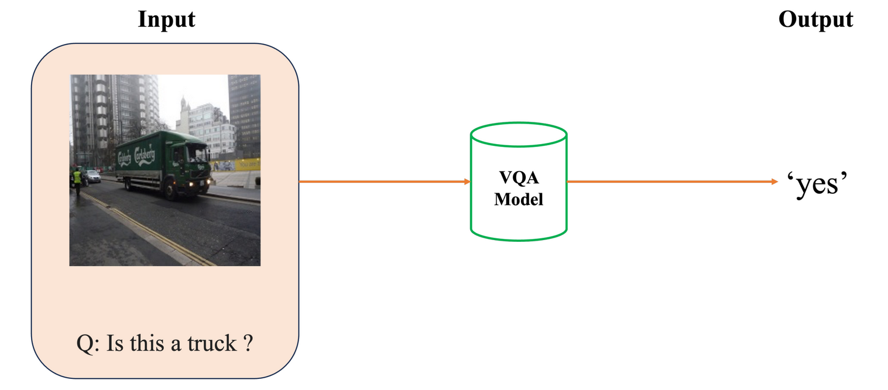
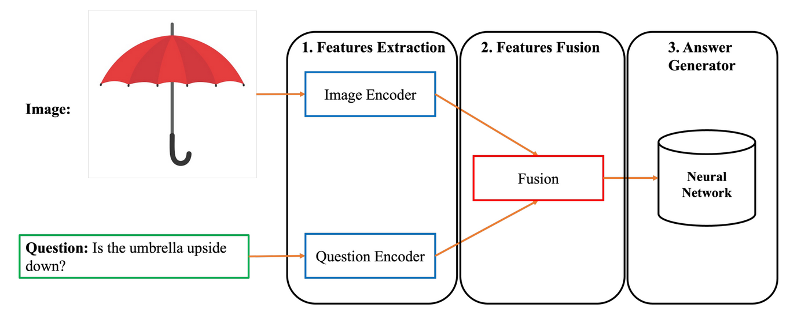

# Visual-Question-Answering

## Introduction

**Visual Question Answering (VQA)** là một bài toán phổ biến trong Machine Learning, ứng dụng các kĩ thuật liên quan đến hai lĩnh vực Computer Vision và Natural Language Processing để giải quyết bài toán này. Mục tiêu cốt lõi của VQA là phân tích một hình ảnh và trả lời câu hỏi về hình ảnh cho trước. Theo đó, bước đầu là phân tính thông tin đầu vào, bao gồm sử dụng các kĩ thuật xử lý hình ảnh và xử lý câu hỏi đặt ra bằng ngôn ngữ tự nhiên. Tiếp đến, mô hình VQA sẽ tổng hợp thông tin thu được từ phân tích hình ảnh và ngữ cảnh của câu hỏi để tạo ra một câu trả lời phù hợp. Vì vậy, một chương trình có độ chính xác cao cần xây dựng tốt cả hai thành phần này, đặt ra thách thức rất lớn trong việc giải quyết tốt bài toán hỏi đáp với ảnh.

Theo đó, Input và Output của một mô hình VQA sẽ có dạng như sau:

• **Input**: Một cặp hình ảnh và câu hỏi bằng ngôn ngữ tự nhiên.
• **Output**: Câu trả lời cho câu hỏi về hình ảnh.

Ở project này, chúng ta sẽ cùng tìm hiểu và xây dựng một mô hình VQA với hướng tiếp cận cơ bản cũng như truyền thống của bài toán này. Theo đó, kiến trúc tổng quan của mô hình mà ta xây dựng như sau:

Trong đó, ba thành phần chính gồm:

1. **Feature Extraction**: Trích xuất các vector đặc trưng phù hợp để đại diện cho dữ liệu ảnh và dữ liệu văn bản.
2. **Features Fusion**: Với hai đặc trưng từ hai nhánh dữ liệu, áp dụng kỹ thuật kết hợp cả hai loại thông tin này về một vector biểu diễn duy nhất.
3. **Answer Generator**: Đưa vector đặc trưng kết hợp vào mạng neural để dự đoán câu trả lời.

Dataset ta sẽ sử dụng là [VQA Coco dataset](https://visualqa.org/) 
Dựa theo kiến trúc trên, ta sẽ cài đặt hai phiên bản gồm phiên bản dựa trên các mạng CNN+LSTM và phiên bản dựa trên các mạng thuộc họ transformer, cụ thể là ViT+RoBERTa.
Ngoài ra, chúng ta cũng sẽ tìm hiểu hướng tiếp cận đang rất được quan tâm hiện nay, đó là sử dụng mô hình lớn. Cụ thể hơn, ta sẽ cài đặt mô hình lớn để có thể giải bài toán VQA trong project này.
